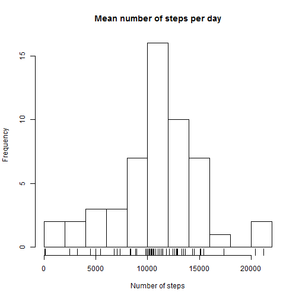
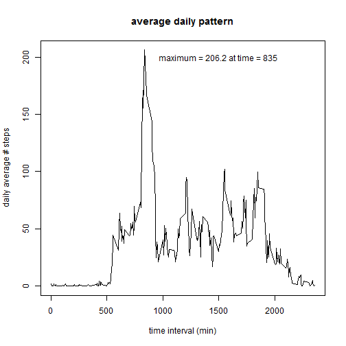

# Reproducible Research: Peer Assessment 1
This assignment uses a sample dataset from a personal activity monitoring device that was provided through the R. Peng's github repository:
https://github.com/rdpeng/RepData_PeerAssessment1

I forked this repository and then used the provided template file to create this summary writeup. First the knitr and lattice packages are required and must be loaded.


```r
library(knitr)
library(lattice)
```
## Loading and preprocessing the data
The dataset is a comma delimited file found in "activity.zip". This archive file is unzipped and the contents are read into a data frame with column classes specified. The code below loads the data from the file into a data frame, and then looks at the head, tail, and summary of the data frame.

```r
dzipfile <- "activity.zip"
unzip(dzipfile)
dfile <- "activity.csv"
df <- read.csv(dfile, header=TRUE, colClasses=c("numeric", "character", "integer"),
               na.strings="NA")
head(df)
```

```
##   steps       date interval
## 1    NA 2012-10-01        0
## 2    NA 2012-10-01        5
## 3    NA 2012-10-01       10
## 4    NA 2012-10-01       15
## 5    NA 2012-10-01       20
## 6    NA 2012-10-01       25
```

```r
tail(df)
```

```
##       steps       date interval
## 17563    NA 2012-11-30     2330
## 17564    NA 2012-11-30     2335
## 17565    NA 2012-11-30     2340
## 17566    NA 2012-11-30     2345
## 17567    NA 2012-11-30     2350
## 17568    NA 2012-11-30     2355
```

```r
summary(df)
```

```
##      steps           date              interval   
##  Min.   :  0.0   Length:17568       Min.   :   0  
##  1st Qu.:  0.0   Class :character   1st Qu.: 589  
##  Median :  0.0   Mode  :character   Median :1178  
##  Mean   : 37.4                      Mean   :1178  
##  3rd Qu.: 12.0                      3rd Qu.:1766  
##  Max.   :806.0                      Max.   :2355  
##  NA's   :2304
```
Next, I wanted to calculate the the number of rows in the data frame, the number of missing values in the data frame, and the number of days with missing values, and look at how many missing values are found in each day's data. This is done below.

```r
#Total number of rows
nRowsInDF <- nrow(df)
#Total number of NA values
nNAvalues <- sum(is.na(df$steps))
#Number of days with NA values found
nMissingDays <- sum(with(df, tapply(is.na(steps), date, sum))>0)
```

```r
with(df, tapply(is.na(steps), date, sum))
```

```
## 2012-10-01 2012-10-02 2012-10-03 2012-10-04 2012-10-05 2012-10-06 
##        288          0          0          0          0          0 
## 2012-10-07 2012-10-08 2012-10-09 2012-10-10 2012-10-11 2012-10-12 
##          0        288          0          0          0          0 
## 2012-10-13 2012-10-14 2012-10-15 2012-10-16 2012-10-17 2012-10-18 
##          0          0          0          0          0          0 
## 2012-10-19 2012-10-20 2012-10-21 2012-10-22 2012-10-23 2012-10-24 
##          0          0          0          0          0          0 
## 2012-10-25 2012-10-26 2012-10-27 2012-10-28 2012-10-29 2012-10-30 
##          0          0          0          0          0          0 
## 2012-10-31 2012-11-01 2012-11-02 2012-11-03 2012-11-04 2012-11-05 
##          0        288          0          0        288          0 
## 2012-11-06 2012-11-07 2012-11-08 2012-11-09 2012-11-10 2012-11-11 
##          0          0          0        288        288          0 
## 2012-11-12 2012-11-13 2012-11-14 2012-11-15 2012-11-16 2012-11-17 
##          0          0        288          0          0          0 
## 2012-11-18 2012-11-19 2012-11-20 2012-11-21 2012-11-22 2012-11-23 
##          0          0          0          0          0          0 
## 2012-11-24 2012-11-25 2012-11-26 2012-11-27 2012-11-28 2012-11-29 
##          0          0          0          0          0          0 
## 2012-11-30 
##        288
```
## What is mean total number of steps taken per day?
The data give the number of steps recorded in each five minute interval of each date. From the summary of the data frame, we see that there are 2304 missing values out of 17568 rows of data. Some exploration (described in the prior section) shows that all the missing values are limited to 8 particular days which have no recorded number of steps at any time of those 8 days.

First we are interested in the total number of steps per day. We calculate the sum by day, and plot a histogram of the number of steps per day. Then, we calculate the mean of the total number of steps per day, with the missing values removed. The median is also calculated for comparison to a later calculation. 

```r
stepsPerDay <- with(df, tapply(steps, date, sum))

hist(stepsPerDay, breaks=8, main="Mean number of steps per day",
        xlab="Number of steps")
rug(stepsPerDay)
```

 

```r
summary(stepsPerDay)
```

```
##    Min. 1st Qu.  Median    Mean 3rd Qu.    Max.    NA's 
##      41    8840   10800   10800   13300   21200       8
```

```r
mean(stepsPerDay, na.rm=TRUE)
```

```
## [1] 10766
```

```r
median(stepsPerDay, na.rm=TRUE)
```

```
## [1] 10765
```

## What is the average daily activity pattern?
Next, we want to see if there is a pattern to the daily activity, so we will average the number of steps for each 5-minute interval across all of the days, and plot this average number of steps vs. time interval. We find the time interval of the maximum number of steps on average, and show this on the figure as well.

```r
avgDailyPattern <- with(df, tapply(steps, interval, mean, na.rm=TRUE))
summary(avgDailyPattern)
```

```
##    Min. 1st Qu.  Median    Mean 3rd Qu.    Max. 
##    0.00    2.49   34.10   37.40   52.80  206.00
```

```r
x5minInterval <- df$interval[1:288]        
maxStepsInterval <- x5minInterval[which(avgDailyPattern==max(avgDailyPattern))]  
maxStepsInterval
```

```
## [1] 835
```

```r
max(avgDailyPattern)
```

```
## [1] 206.2
```

```r
plot(x5minInterval, avgDailyPattern, type="l",
     xlab="time interval (min)", ylab="daily average # steps",
     main="average daily pattern")   
text(1500, 200, paste("maximum =", 
                      sprintf("%4.1f", max(avgDailyPattern)), "at time =",
                      maxStepsInterval))
```

 
                      
## Inputing missing values
As noted earlier, there are missing values for 8 of the days. These 8 days are entirely empty, and will be replaced with the average number of steps by 5-mintue interval, which we calculated above. The histogram of this modified dataset with missing values replaced is then replotted.

```r
numMissing <- sum(is.na(df$steps))
numMissing
```

```
## [1] 2304
```

```r
dfModified <- df

for (i in 1:length(dfModified$steps)){
  if(is.na(dfModified$steps[i])){
    dfModified$steps[i] <- avgDailyPattern[which(x5minInterval==dfModified$interval[i])]
  }
}
stepsPerDayMod <- with(dfModified, tapply(steps, date, sum))

hist(stepsPerDayMod, breaks=8, main="Mean number of steps per day, missing data input", xlab="Number of steps")
rug(stepsPerDayMod)
```

 

The median and mean of the modified dataset are calculated and compared against the median and mean of the original dataset. Notice that the mean values are unchanged by the modification for missing values, but the median has shifted to a slightly higher value.

```r
summary(stepsPerDayMod)
```

```
##    Min. 1st Qu.  Median    Mean 3rd Qu.    Max. 
##      41    9820   10800   10800   12800   21200
```

```r
mean(stepsPerDayMod)
```

```
## [1] 10766
```

```r
median(stepsPerDayMod)
```

```
## [1] 10766
```

```r
summary(stepsPerDay)
```

```
##    Min. 1st Qu.  Median    Mean 3rd Qu.    Max.    NA's 
##      41    8840   10800   10800   13300   21200       8
```

```r
mean(stepsPerDay, na.rm=TRUE)
```

```
## [1] 10766
```

```r
median(stepsPerDay, na.rm=TRUE)
```

```
## [1] 10765
```

## Are there differences in activity patterns between weekdays and weekends?
Finally we are interested to learn if there are differences in activity patterns on weekdays compared to weekends. So, we average the number of steps in 5-minute intervals across days by type: weekday or weekend. Then, we plot the average number of steps by interval in a panel plot to visually compare the weekday values to weekend values. We can see that on weekdays, the number of steps begins to increase at an earlier time, indicating that this person rises earlier on weekdays. Also, the number of steps decreases at a later time on weekends, indicating that the person goes to sleep at a later hour on weekends. 

```r
dfModified$type <- "weekday"
for (i in 1:length(dfModified$steps)){
  if(weekdays(as.Date(dfModified$date[i], "%Y-%m-%d"))=="Saturday" |
     weekdays(as.Date(dfModified$date[i], "%Y-%m-%d"))=="Sunday"){
    dfModified$type[i] <- "weekend"
  }
}
dfModified$type <- as.factor(dfModified$type)
summary(dfModified$type)
```

```
## weekday weekend 
##   12960    4608
```

```r
avgWDPattern <- with(dfModified[dfModified$type=="weekday",], tapply(steps, interval, mean, na.rm=TRUE))
avgWEPattern <- with(dfModified[dfModified$type=="weekend",], tapply(steps, interval, mean, na.rm=TRUE))

x5minInterval2 <- dfModified$interval[1:288]

avgsteps <- c(avgWDPattern, avgWEPattern)
avgInt <- c(x5minInterval2, x5minInterval2)
avgType <- ""
avgType[1:288] <- "weekday"
avgType[289:576] <- "weekend"
avgType <- as.factor(avgType)
dfnew <- data.frame(avgInt, avgsteps, avgType)


xyplot(avgsteps ~ avgInt|avgType, data = dfnew, layout=c(1,2),
       type="l", main="Weekend vs. Weekday Activity Patterns", 
       xlab="Interval", ylab="Number of steps")
```

 

